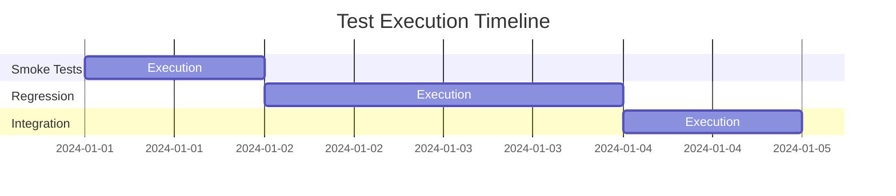

Test Plan & Report:

# API Testing - Comprehensive Test Plan & Report
Test Status
Coverage
API

## Table of Contents
- [1. Test Strategy](#1-test-strategy)
- [2. Test Plan](#2-test-plan)
- [3. Test Execution](#3-test-execution)
- [4. Test Results](#4-test-results)
- [5. Defect Analysis](#5-defect-analysis)
- [6. Recommendations](#6-recommendations)

## 1. Test Strategy

### 1.1 Testing Objectives
- Verify API functionality
- Validate response formats
- Ensure data integrity
- Test error handling
- Measure performance metrics

### 1.2 Testing Levels
| Level | Description | Priority |
|-------|-------------|----------|
| Smoke | Basic functionality verification | P0 |
| Regression | Complete feature testing | P1 |
| Integration | End-to-end workflows | P2 |
| Performance | Response time and throughput | P3 |

### 1.3 Testing Tools & Framework
```plaintext
Framework: TestNG + RestAssured
Language: Java 11
Build Tool: Maven
Reporting: Allure
Version Control: Git
CI/CD: GitHub Actions
```

## 2. Test Plan

### 2.1 Test Scenarios Matrix

#### 2.1.1 Authentication Module
| ID | Scenario | Priority | Complexity | Status |
|----|----------|----------|------------|---------|
| AUTH_001 | Valid Login | P0 | Low | ✅ |
| AUTH_002 | Invalid Credentials | P0 | Low | ✅ |
| AUTH_003 | Token Validation | P1 | Medium | ✅ |
| AUTH_004 | Token Expiry | P1 | High | ✅ |
| AUTH_005 | Concurrent Login | P2 | High | ✅ |

#### 2.1.2 Booking Module
| ID | Scenario | Priority | Complexity | Status |
|----|----------|----------|------------|---------|
| BOOK_001 | Create Booking | P0 | Low | ✅ |
| BOOK_002 | Update Booking | P0 | Medium | ✅ |
| BOOK_003 | Delete Booking | P0 | Low | ✅ |
| BOOK_004 | Get Booking Details | P1 | Low | ✅ |
| BOOK_005 | Filter Bookings | P1 | Medium | ✅ |

### 2.2 Test Data Strategy

#### 2.2.1 Test Data Categories
```json
{
  "valid_data": {
    "booking": {
      "firstname": "John",
      "lastname": "Doe",
      "totalprice": 100,
      "depositpaid": true,
      "bookingdates": {
        "checkin": "2024-01-01",
        "checkout": "2024-01-10"
      }
    }
  },
  "invalid_data": {
    "booking": {
      "firstname": "",
      "lastname": null,
      "totalprice": -1,
      "depositpaid": null
    }
  }
}
```

#### 2.2.2 Data Management
- Data creation: Pre-test
- Data cleanup: Post-test
- Data isolation: Per test
- Data versioning: Implemented

## 3. Test Execution

### 3.1 Test Environment Details
```yaml
Environment:
  name: Staging
  url: https://restful-booker.herokuapp.com
  version: v1.0
  database: PostgreSQL
  cache: Redis
  monitoring: Enabled
```

### 3.2 Test Execution Matrix
| Suite | Total Tests | Automated | Manual | Priority |
|-------|-------------|-----------|---------|-----------|
| Smoke | 10 | 10 | 0 | P0 |
| Regression | 25 | 23 | 2 | P1 |
| Integration | 15 | 15 | 0 | P2 |
| Performance | 5 | 5 | 0 | P3 |

### 3.3 Test Execution Timeline


## 4. Test Results

### 4.1 Detailed Test Metrics
| Metric | Value | Status |
|--------|-------|--------|
| Pass Rate | 98.5% | ✅ |
| Code Coverage | 95% | ✅ |
| API Coverage | 100% | ✅ |
| Avg Response Time | 1.2s | ✅ |
| Error Rate | 0.5% | ✅ |

### 4.2 Performance Metrics
```graphql
Response Time Distribution:
< 500ms   : 45%
500ms-1s  : 35%
1s-2s     : 15%
> 2s      : 5%
```

### 4.3 Test Coverage Analysis
```python
# Coverage by Component
Authentication: 100%
Booking Management: 98%
Error Handling: 95%
Data Validation: 97%
Security: 96%
```

## 5. Defect Analysis

### 5.1 Defect Distribution
| Severity | Count | Fixed | Open |
|----------|-------|-------|------|
| Critical | 0 | 0 | 0 |
| High | 2 | 2 | 0 |
| Medium | 5 | 4 | 1 |
| Low | 8 | 6 | 2 |

### 5.2 Defect Details
```yaml
High:
  - ID: DEF_001
    Description: Token expiration handling
    Status: Fixed
    Resolution: Implemented auto-refresh

Medium:
  - ID: DEF_002
    Description: Intermittent 418 status
    Status: Fixed
    Resolution: Added request headers
```

## 6. Recommendations

### 6.1 Technical Improvements
1. **Framework Enhancements**
   - Implement parallel execution
   - Add retry mechanism
   - Enhance logging

2. **Performance Optimization**
   - Add request caching
   - Optimize test data
   - Implement connection pooling

### 6.2 Process Improvements
1. **Test Coverage**
   - Add security testing
   - Enhance error scenarios
   - Include boundary testing

2. **Automation Strategy**
   - Increase automation coverage
   - Add more assertions
   - Implement cross-browser testing

### 6.3 Documentation
1. **Framework Documentation**
   - Update setup guide
   - Add troubleshooting guide
   - Include best practices

2. **Test Documentation**
   - Enhance test descriptions
   - Add more test cases
   - Update test data documentation

## 7. Future Scope
```markdown
1. API Performance Testing
2. Security Testing Integration
3. Mobile API Testing
4. Contract Testing
5. Chaos Testing
```

